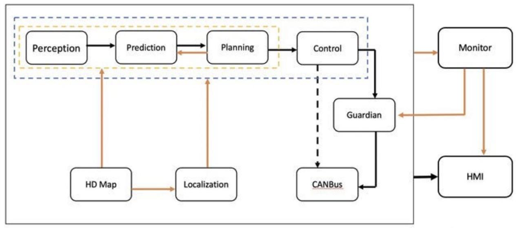
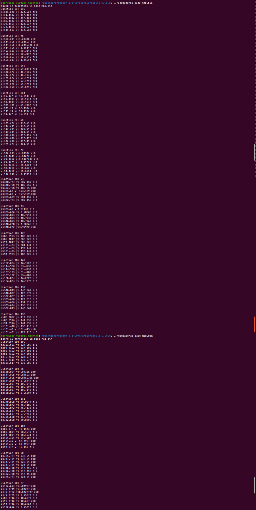
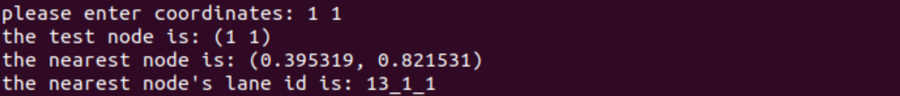
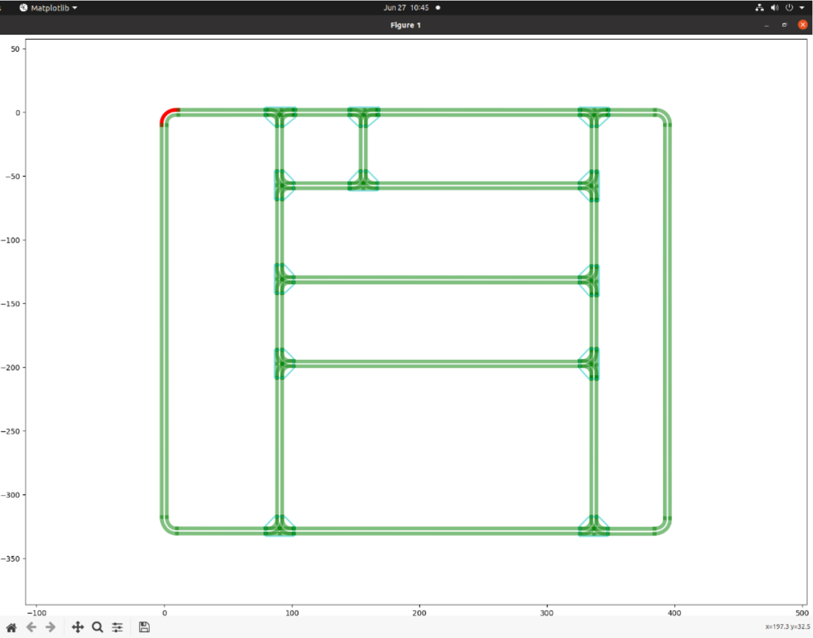
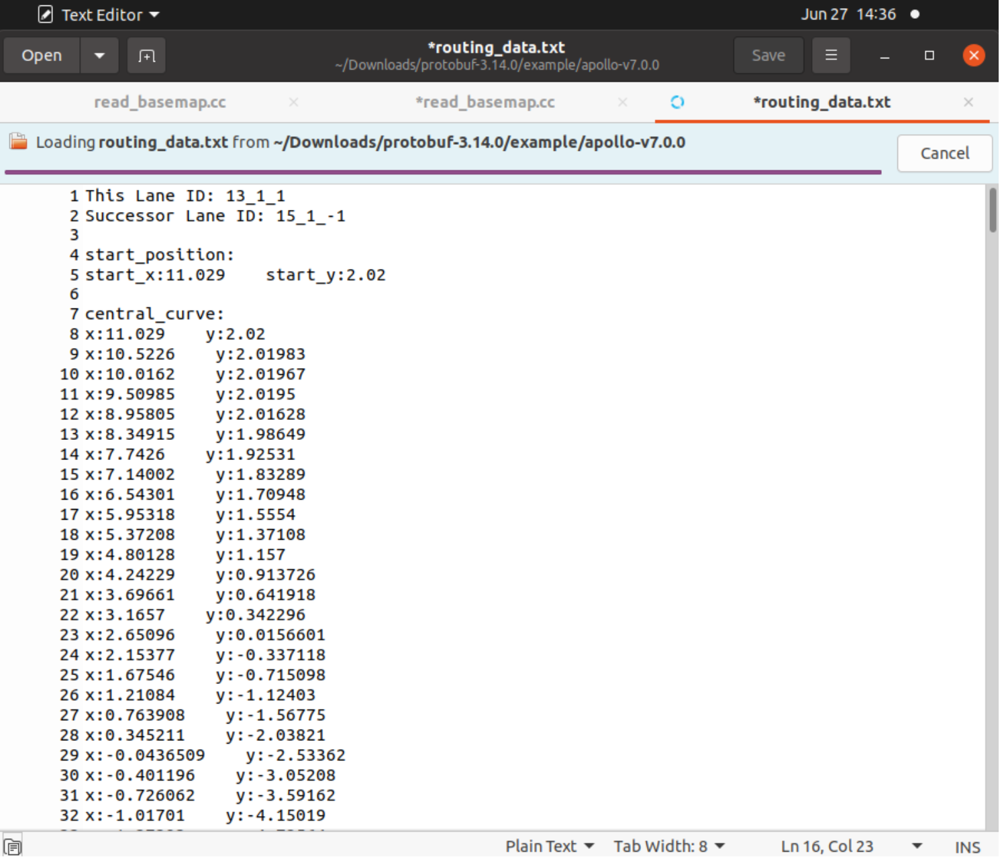

# intern2 [(click for more..)](https://yanhao5103233729.github.io/edu/)
c++, 2023 Summer Intern Baidu Apollo Autonomous Driving Project at ISCAS, Beijing [[paper](https://drive.google.com/file/d/1QpBO1KFtsDsGNAb7DDbin5JoYx22LSGF/view) | [code](https://github.com/yanhao5103233729/intern2) | [video](https://youtu.be/3sck9b50zp4)]


## Project Overview
The Baidu Apollo Autonomous Driving system is a comprehensive solution to autonomous driving raised by Baidu. It incorporates the entire workflow of unmanned driving and proposes a thorough solution encompassing system infrastructure, software application, and data learning. As is shown below:


In order to work closely with various teams at Integration Center, ISCAS, to propose a comprehensive solution for Baidu Apollo Autonomous Driving Project as mentioned, linking functionalities of bottom layers, software usage, and date learning, etc., to connect the entire autonomous driving workflow, I Coded, tested, debugged, implemented and documented the following two modules using C++(primary) and Python.

For HDMap, this module involves the development of a path planning system using high-precision map data. Its primary goal is to implement an efficient algorithm for path planning using protobuf for map data parsing. The system can process various data structures, including kd-trees, to facilitate effective map representation and route calculation.

For Routing, this module involves.. 

## Objectives and Task Breakdown
**Goal**: To read high-precision map data and implement a path planning algorithm.

**Tasks and Outcomes**:
1. **Map Parsing**: Utilize protobuf for reading map files.


2. **Data Structuring**: Design data structures to store map data post-parsing and construct kd-trees.


3. **Map Visualization**: Attempt to display maps using graphical libraries.


4. **Route Identification**: Identify roads and subsequent path points based on input coordinates.



## Installation

### Prerequisites
- C++(primary) and Python environments
- [Ubuntu 20.04](https://www.releases.ubuntu.com/20.04/)
- [Protobuf library](https://github.com/protocolbuffers/protobuf/)

### Steps
1. Clone the repository
2. Navigate to the project directory
3. (Optional) Set up a virtual environment
4. Install the required dependencies

## Usage
1. Compile the C program: ```g++ -o read_basemap read_basemap.cc```
2. Run the compiled executable (for example, for HDMap): ```./read_basemap```
3. Follow the on-screen instructions for map parsing, data structuring, map visualization, and route identification. (for HDMap; see [video](https://youtu.be/3sck9b50zp4) for Routing)

## Contributing
To contribute to this project:
1. Fork the repository.
2. Create a new branch for your features or fixes.
3. Commit your changes.
4. Push to your branch.
5. Create a pull request.

More details on contributions can be found in the GitHub guide on [creating a pull request](https://docs.github.com/en/github/collaborating-with-issues-and-pull-requests/creating-a-pull-request).

## License
This project is licensed under the [MIT License](LICENSE.md) - see the LICENSE file for details.
