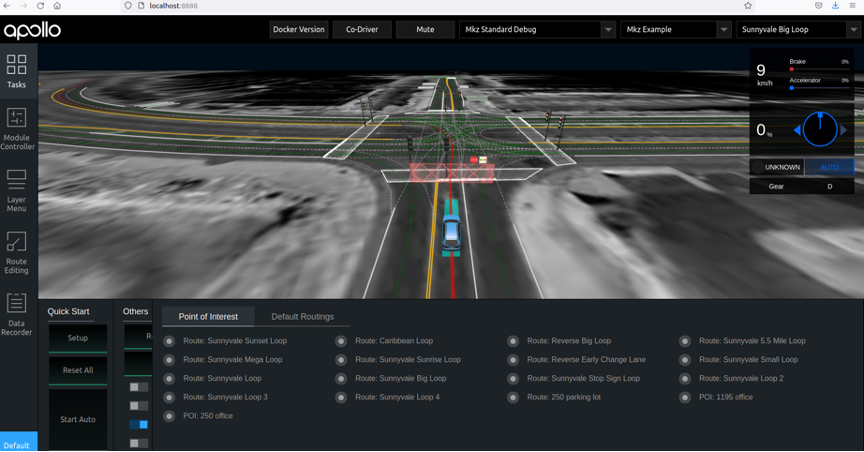

# intern2 [(click for more..)](https://yanhao5103233729.github.io/edu/)
c++, 2023 Summer Intern Baidu Apollo Autonomous Driving Project at ISCAS, Beijing [[paper](https://drive.google.com/file/d/1QpBO1KFtsDsGNAb7DDbin5JoYx22LSGF/view/) | [code](https://github.com/yanhao5103233729/intern2/) | [video](https://youtu.be/3sck9b50zp4/)]


## Project Overview
In 2023 Summer, I worked closely with various teams at Integration Center, [ISCAS](https://youtu.be/3sck9b50zp4/), to propose a comprehensive solution for [Baidu Apollo Autonomous Driving Project](https://github.com/ApolloAuto/apollo), linking functionalities of bottom layers, software usage, and date learning, etc., to connect the entire autonomous driving workflow. I Coded, tested, debugged, implemented and documented the following two modules using C++(primary) and Python.


For HDMap, its primary goal is to implement an efficient algorithm by utilizing protobuf to read high-precision maps in Opendrive format, build up KDTree storing map data, implement the functionality of finding the road and subsequent nodes based on the entered starting point coordinates, lastly visualize results via PCL, Qt, Vtk, OpenCV.

For Routing, its primary goal is to deploy the two methods of visualizing the system’s expected routing functions, by utilizing Apollo’s built-in tools of Dreamview (Apollo6.0) and OSM (Apollo3.0).

## HDMap Task Breakdown
**Goal**: To read high-precision map data and implement a path planning algorithm.

**Tasks**:
1. **Map Parsing**: Utilize protobuf for reading map files.
2. **Data Structuring**: Design data structures to store map data post-parsing and construct kd-trees.
3. **Map Visualization**: Attempt to display maps using graphical libraries.
4. **Route Identification**: Identify roads and subsequent path points based on input coordinates.

## HDMap Installation

### Prerequisites
- C++(primary) and Python environments
- [Ubuntu 20.04](https://www.releases.ubuntu.com/20.04/)
- [Protobuf library](https://github.com/protocolbuffers/protobuf/)

### Usage
1. Open the folder - hdmap
2. Compile the C program: ```g++ -o read_basemap read_basemap.cc```
3. Run the compiled executable: ```./read_basemap```
4. Follow the on-screen instructions for map parsing, data structuring, map visualization, and route identification.

### Outcomes


## Routing Installation

### Prerequisites
- Install NVIDIA GPU Driver, Docker Engine, NVIDIA Container Toolkit.
- Download Apollo 6.0 source code, pull the image, and compile.

### Usage (Option1: Dreamview)
1. Open the folder - routing
2. Run the Dreamview command: ```./scripts/bootstrap.sh start``` and access the initialization interface at [http://localhost:8888/](http://localhost:8888/). Note: Check if the CPU supports FMA and AVX, as Dreamview won't start otherwise. The browser must support WebGL for simulation interface animations. The GPU does not necessarily have to be NVIDIA but should be compatible.
3. Running the Recorder File: select “Mkz Standard Debug” as the driving mode, select “Lincoln2017MKZLGSVL” as the vehicle type, select “Sunnyvale with Two Offices” as the map. Then start Dreamview and run the following commands:
```
[shaw@in-dev-docker:/apollo]$ ./scripts/bootstrap.sh start
```
```
Dreamview is running at http://localhost:8888
```
```
[shaw@in-dev-docker:/apollo]$ cyber_recorder play -f docs/demo_guide/demo_3.5.record -l
```
4. Executing Path Planning: restart Dreamview and select “Sunnyvale Big Loop” as the map, enable the “Planning” and “Routing” modules and choose the “Route: Reverse Early Change Lane” option. If the road output shows the vehicle's planned trajectory and it moves forward, it indicates successful project build and run.

### Outcomes



### Usage (Option2: OSM Pathfinding)
The above experiment uses Dreamview for visual path planning demonstration. Below is a guide using OSM (openstreetmap) for visualization.

For running the project demo, visit [https://daohu527.github.io](https://daohu527.github.io/). To create your maps, follow the instructions below:

Step1: Export a map from OSM in OSM format and view it in a browser. Official website: [https://www.openstreetmap.org/export#map=15/22.5163/113.9380](https://www.openstreetmap.org/export#map=15/22.5163/113.9380/)

Step2: In the project's tools directory, convert the OSM map into a Graph format used by the project.

Debugging Tools
In the routing/tools directory, the following functionalities are implemented:
- routing_cast.cc: Timely sends routing response.
- routing_dump.cc: Saves routing requests.
- routing_tester.cc: Timely sends routing request.

1. Open the folder - routing
2. Clone the osm-pathfinding repository and start an HTTP server in the osm-pathfinding folder, access the osm.html page in a web browser.
```
git clone https://github.com/daohu527/osm-pathfinding.git
```
```
cd osm-pathfinding
```
```
python -m SimpleHTTPServer
```
Note: Use Mapbox & OpenStreetMap for designing and publishing maps; leaflet is used for interactive map markers, and Bootstrap for responsive front-end design. OSM data can be looked up using specific URLs for polygons, nodes, and multipolygons in the OSM database.

### Outcomes

See [video](https://youtu.be/3sck9b50zp4/) here.

## Contributing
To contribute to this project:
1. Fork the repository.
2. Create a new branch for your features or fixes.
3. Commit your changes.
4. Push to your branch.
5. Create a pull request.

More details on contributions can be found in the GitHub guide on [creating a pull request](https://docs.github.com/en/github/collaborating-with-issues-and-pull-requests/creating-a-pull-request).

## License
This project is licensed under the [MIT License](LICENSE.md) - see the LICENSE file for details.
